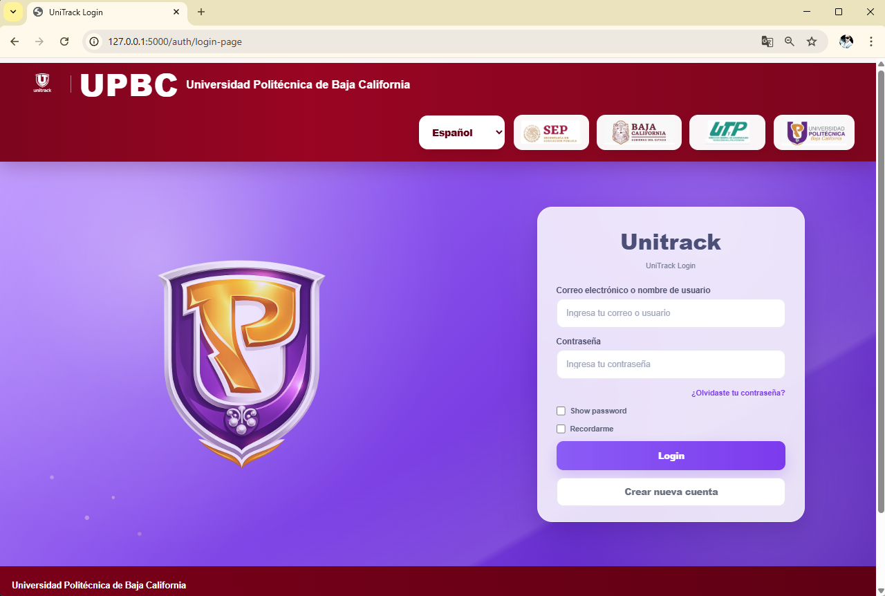
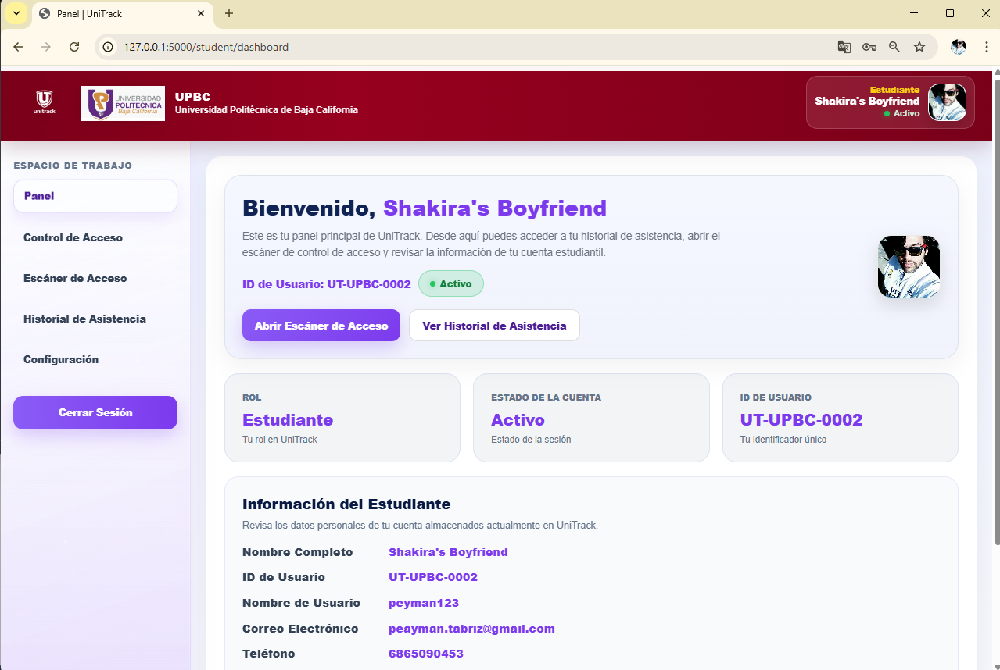
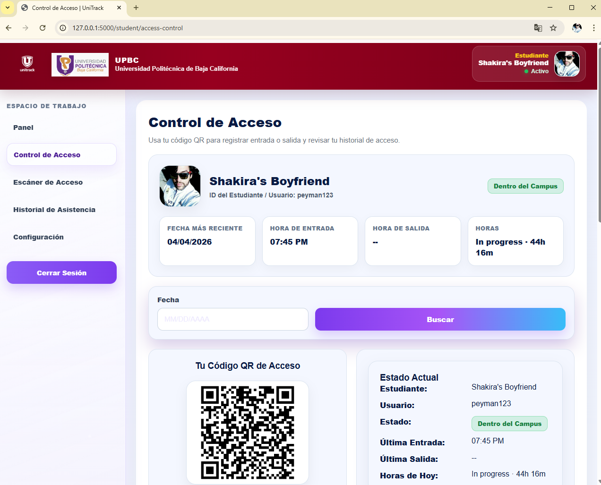
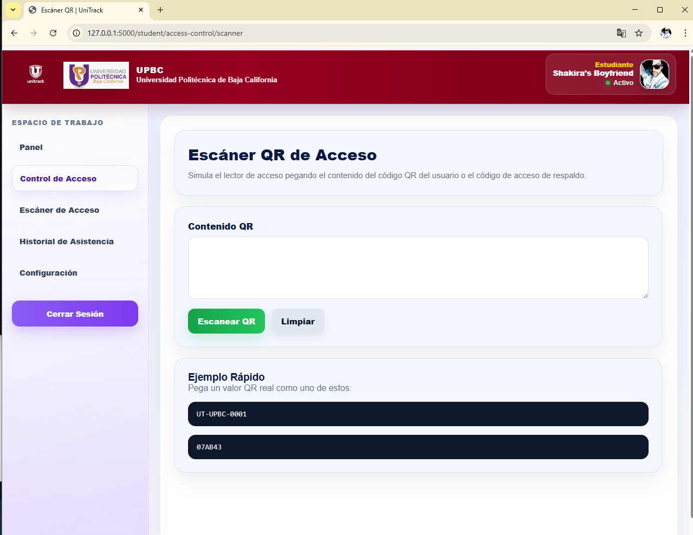
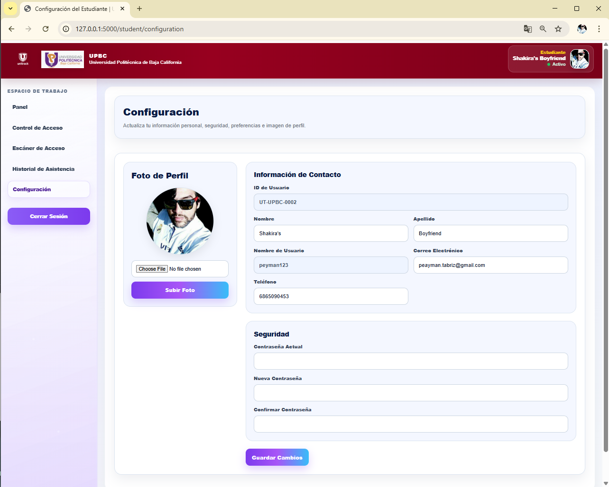
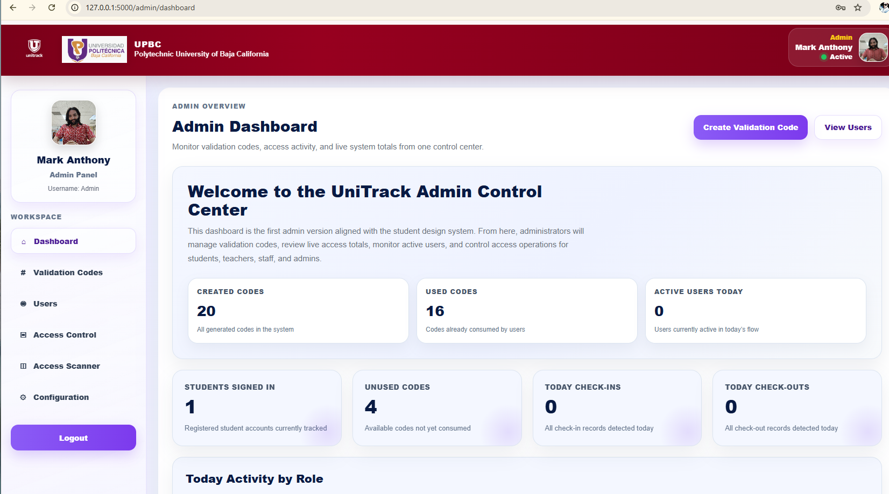

# 🎓 UniTrack


**UniTrack** is a university attendance and access control system designed to manage student, staff, and professor presence using QR-based check-in and check-out.

---

## 🌐 Live Demo

🔗 https://unitrack-6ozt.onrender.com

> Note: Render free tier may take a little time to wake up after inactivity.

---

## 🚀 Features

* 🔐 Role-based authentication (Admin, Student, Professor, Staff)
* 📱 QR Code access control (check-in / check-out)
* ⏱ Automatic time tracking and attendance logs
* 🧾 Validation code system for secure registration
* 👤 User management (admin panel)
* 🌐 Clean and responsive UI (mobile-friendly)
* 🔄 Real-time access status tracking

---

## 📸 Screenshots

### 🔐 Login



### 📊 Dashboard



### 🎫 Access Control



### 📱 QR Scanner



### 📜 Attendance History


### ⚙️ Configuration



### 🛠️ Admin Dashboard



---

## 🏗️ Tech Stack

* **Backend:** Python, Flask
* **Database:** SQLite (dev) / PostgreSQL (production ready)
* **ORM:** SQLAlchemy
* **Auth:** Flask-Login
* **Migrations:** Flask-Migrate (Alembic)
* **QR Generation:** qrcode
* **Frontend:** HTML, CSS, Jinja2

---

## 📁 Project Structure

```
unitrack/
│
├── app/
│   ├── models/
│   ├── routes/
│   ├── services/
│   ├── templates/
│   └── static/
│
├── migrations/
├── run.py
└── requirements.txt
```

---

## ⚙️ Installation

```bash
git clone https://github.com/Peyman-mxli/unitrack.git
cd unitrack
python -m venv venv
venv\Scripts\activate
pip install -r requirements.txt
```

---

## ▶️ Run the App

```bash
flask run
```

Or:

```bash
python run.py
```

---

## 🌐 Access

Local:

```
http://127.0.0.1:5000
```

Network:

```
http://<your-ip>:5000
```

---

## 🔑 Default Admin

> Admin is automatically created on startup (if not exists)

---

## 📌 Roadmap

* [ ] Advanced attendance history
* [ ] Mobile app integration
* [ ] More admin features
* [ ] More teacher features
* [ ] Better design and structure

---

## 📄 License

This project is licensed under the MIT License.

---

## ⭐ Support

If you like this project, give it a ⭐ on GitHub!


---

👤 Author


Peyman Miyandashti
🎓 Polytechnic University of Baja California
💻 Information Technology Engineering & Digital Innovation
📍 From Mexico
📅 Year: 2026
🆔 ID: 250161


---

